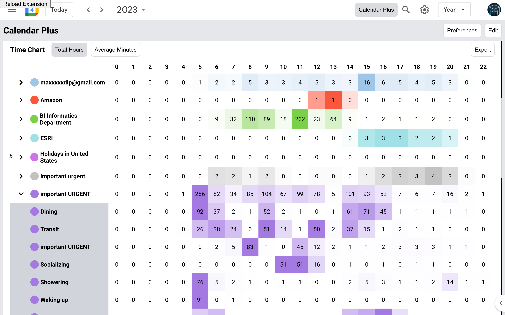

# Calendar Plus

[A browser extension for Google Calendar](https://chrome.google.com/webstore/detail/calendar-plus/kgbbebdcmdgkbopcffmpgkgcmcoomhmh)
that provides insights into where your time goes. Includes power user tools,
data export and customization

[Add to Chrome](https://chrome.google.com/webstore/detail/calendar-plus/kgbbebdcmdgkbopcffmpgkgcmcoomhmh)

Features:

- Plot your week/month/year using Bar Chart, Pie Chart or a Time Chart
- Adds ability to ghost an event (make it semi transparent and non-interactive)
- Adds ability to condense the interface to have more space for events
- Adds autocomplete for event names when creating events
- Allows to automatically place events into correct calendars based on defined
  rules
- Supports exporting plotted data and exporting/importing plugin settings

[Privacy Policy](https://calendar-plus.patii.uk/docs/privacy/)

[Video Demo](https://youtu.be/FZ_468t033A)

[Report a Bug/Feature Request](https://github.com/maxpatiiuk/calendar-plus/issues/new)

## Screenshots

Column chart: [](https://youtu.be/FZ_468t033A)

Time chart: [](https://youtu.be/FZ_468t033A)

Pie chart: [](https://youtu.be/FZ_468t033A)

Settings: [](https://youtu.be/FZ_468t033A)

Expanded time chart
[](https://youtu.be/FZ_468t033A)

Editing the layout
[](https://youtu.be/FZ_468t033A)

## Local Installation

1. Pre-requisites:

   ```
   Node.js 18
   Npm 8
   ```

2. Complete installation steps in [./backend](./backend/)

3. Complete installation steps in [./src](./src/)
